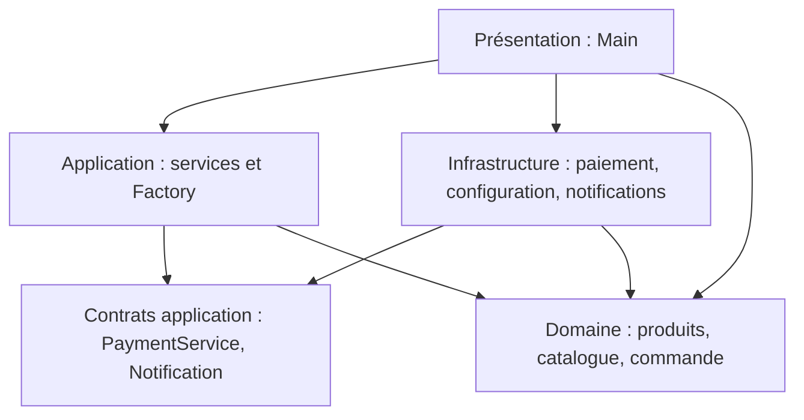

# TP1 — Design Patterns

**INSAT · Architectures Réactives et Microservices · RT5 · 2026–2027**

**Ali Dridi et Rayenne Abid**

Application Java pédagogique de boutique en ligne : création de produits, configuration partagée, adaptation d'un paiement, catalogue arborescent et notifications. Six patterns sont illustrés : **Factory, Singleton, Adapter, Composite, Observer et Strategy**.

Ce dépôt contient les sources Java de l'application et des tests, ainsi que ce README. Il ne nécessite aucun framework ni bibliothèque externe.

## Prérequis

Installer un **JDK 17 ou supérieur**, puis ouvrir un terminal à la racine du projet. Vérifier que les deux commandes suivantes utilisent une version 17 ou supérieure :

```text
java -version
javac -version
```

Un JRE seul ne suffit pas : `javac` est le compilateur fourni par le JDK. Si nécessaire, ajouter le dossier `bin` du JDK au `PATH` du terminal. Les fichiers `.java` sont les sources à lire et modifier ; les `.class` produits par la compilation vont dans `build/`.

## Compiler sous Windows / PowerShell

Exécuter ces commandes depuis la racine du dépôt :

```powershell
New-Item -ItemType Directory -Force -Path build/classes, build/test-classes | Out-Null

$mainSources = @(Get-ChildItem -Path src/main/java -Filter *.java -Recurse | Select-Object -ExpandProperty FullName)
javac --release 17 -encoding UTF-8 -Xlint:all -d build/classes $mainSources
if ($LASTEXITCODE -ne 0) { throw 'Compilation du projet echouee' }

$testSources = @(Get-ChildItem -Path src/test/java -Filter *.java -Recurse | Select-Object -ExpandProperty FullName)
javac --release 17 -encoding UTF-8 -Xlint:all -cp build/classes -d build/test-classes $testSources
if ($LASTEXITCODE -ne 0) { throw 'Compilation des tests echouee' }
```

Lancer ensuite toutes les démonstrations et tous les tests :

```powershell
java -cp build/classes tn.insat.tp1.presentation.Main
java -cp "build/classes;build/test-classes" tn.insat.tp1.PatternTests
```

Résultat attendu des tests : **`Tests: 15 passed, 0 failed.`** Un échec affiche `[FAIL]`, le détail de l'erreur et produit un code de sortie non nul. Après avoir modifié une source, relancer les commandes de compilation avant les démonstrations ou les tests.

## Compiler sous Linux / macOS

```sh
mkdir -p build/classes build/test-classes
find src/main/java -name '*.java' | sort > build/main-sources.txt
find src/test/java -name '*.java' | sort > build/test-sources.txt
javac --release 17 -encoding UTF-8 -Xlint:all -d build/classes @build/main-sources.txt
javac --release 17 -encoding UTF-8 -Xlint:all -cp build/classes -d build/test-classes @build/test-sources.txt

java -cp build/classes tn.insat.tp1.presentation.Main
java -cp 'build/classes:build/test-classes' tn.insat.tp1.PatternTests
```

Si une compilation échoue, corriger l'erreur avant de lancer la suite. Le séparateur du classpath est `;` sous Windows et `:` sous Linux/macOS.

## Tester chaque partie

Après compilation, ajouter le numéro de la partie comme argument. Exemple pour la **partie 2 — Factory**, sous Windows :

```powershell
# Voir la démonstration
java -cp build/classes tn.insat.tp1.presentation.Main 2

# Vérifier automatiquement cette partie
java -cp "build/classes;build/test-classes" tn.insat.tp1.PatternTests 2
```

Remplacer `2` par un numéro de `3` à `7`. Sans argument, ou avec `all`, toutes les parties exécutables sont lancées. Sous Linux/macOS, remplacer le `;` du classpath des tests par `:`.

| Partie | Pattern / sujet | Résultat attendu de la démonstration | Tests |
| --- | --- | --- | --- |
| 1 | Analyse du code initial | Expliquer le couplage, les responsabilités mélangées, les conditions répétées et l'OCP. | Analyse écrite |
| 2 | Factory | Création de Book, Electronic, Clothing et Food ; `Food: Pasta - 12.0`. | 4 |
| 3 | Singleton | `Same instance: true`. | 1 |
| 4 | Adapter | `Payment : 250.0`. | 2 |
| 5 | Composite | Catalogue avec catégories et produits indentés. | 2 |
| 6 | Observer | État initial `CREATED`, puis Email, Stock et Logger reçoivent `SHIPPED`. | 4 |
| 7 | Strategy | Messages Email, SMS, Push Notification et WhatsApp. | 2 |
| 8 | Architecture | Justifier les couches, la place des classes et le sens des dépendances. | Analyse écrite |

Les numéros correspondent aux parties du sujet. Les questions demandant de justifier, comparer ou expliquer nécessitent aussi une réponse écrite ou orale.

Dans un IDE, choisir le JDK 17+, déclarer `src/main/java` et `src/test/java` comme dossiers de sources, puis lancer `tn.insat.tp1.presentation.Main` ou `tn.insat.tp1.PatternTests`. Utiliser le numéro de partie comme argument du programme pour une exécution ciblée.

## Organisation du code

```text
src/main/java/tn/insat/tp1/
  presentation/Main.java            Démonstration et assemblage des composants
  application/                      OrderService, ProductFactory, NotificationService
    port/                           PaymentService, Notification
  domain/
    product/                        Product, AbstractProduct, Book, Electronic, Clothing, Food
    catalog/                        CatalogComponent, CatalogProduct, Category
    order/                          Order, Subject, Observer
  infrastructure/
    config/                         ApplicationConfig
    payment/                        OldPaymentSystem, PaymentAdapter
    observer/                       EmailService, StockService, LoggerService
    notification/                   EmailNotification, SmsNotification,
                                    PushNotification, WhatsAppNotification
src/test/java/tn/insat/tp1/
  PatternTests.java                 15 scénarios de vérification
```

Les exemples se trouvent dans [Main.java](src/main/java/tn/insat/tp1/presentation/Main.java), et les assertions dans [PatternTests.java](src/test/java/tn/insat/tp1/PatternTests.java). Modifier la démonstration ne modifie pas les données des tests.

## Avant / après et justification des patterns

| Pattern | Problème initial | Solution et bénéfice |
| --- | --- | --- |
| Factory | `OrderService` construit directement les produits avec une suite de conditions. | `ProductFactory` centralise la construction ; Food est ajouté sans changer la logique du service. |
| Singleton | Chaque composant peut créer sa propre configuration. | Constructeur privé, instance statique et `getInstance()` donnent accès au même objet. |
| Adapter | Le client attend `pay()`, alors que le système existant fournit `makePayment()`. | `PaymentAdapter` implémente `PaymentService` et délègue sans modifier le système existant. |
| Composite | Produits et catégories sont traités différemment. | `CatalogComponent` unifie les feuilles et les catégories ; `Category` affiche récursivement ses composants. |
| Observer | `Order` appelle directement chaque service concret. | La commande connaît uniquement `Observer` et prévient ses abonnés lors d'un changement d'état. |
| Strategy | Les canaux de notification sont codés dans des `if/else`. | `NotificationService` délègue à une stratégie injectée ; WhatsApp est une implémentation supplémentaire. |

La Factory est ici une **Simple Factory**. Ajouter un type nécessite encore un nouveau cas dans son `switch` ; `OrderService` reste inchangé. Ce n'est pas le pattern GoF Factory Method.

## Architecture en couches

Les flèches indiquent les dépendances du code. Le domaine n'importe aucune classe d'application ou d'infrastructure ; `Main` assemble les implémentations concrètes.



`Product` et `Order` sont dans le domaine ; `ProductFactory` et `OrderService` sont dans l'application ; `PaymentAdapter`, `EmailService` et `ApplicationConfig` sont dans l'infrastructure. `PaymentService` et `Notification` définissent les contrats utilisés par l'application et implémentés par l'infrastructure.

Un pattern résout un problème local. L'architecture organise les responsabilités et les dépendances de l'ensemble du système. Les méthodes `display()` conservent les sorties console demandées par le TP ; une interface Web ou mobile pourrait déplacer ce rendu dans la présentation.

## Expérimenter

- **Factory :** dans `Main.factory()`, changer un nom ou un prix. Un type inconnu ou un prix négatif est refusé.
- **Singleton :** modifier `c1.setApplicationName("Ma boutique")`, puis lire `c2.getApplicationName()` : la valeur est partagée.
- **Adapter :** remplacer `payment.pay(250)` par `payment.pay(100)` : la sortie devient `Payment : 100.0`.
- **Composite :** ajouter une catégorie dans `books`, puis un produit dans cette catégorie : l'indentation augmente d'un niveau.
- **Observer :** retirer l'abonnement de `LoggerService` : seules les lignes Email et Stock s'affichent.
- **Strategy :** ne garder que `WhatsAppNotification` dans la liste des canaux : seul WhatsApp s'affiche.

Après chaque modification, recompiler puis relancer la partie concernée. Les tests couvrent aussi les entrées invalides, les cycles du catalogue, le désabonnement d'un observateur et l'injection d'un nouveau canal.

Les paiements et notifications sont simulés par la console. La configuration ne démarre aucune base de données. Le Singleton garantit l'unicité de l'instance dans son chargeur de classes ; cette démonstration synchrone ne synchronise pas les setters ni les collections entre plusieurs threads.
